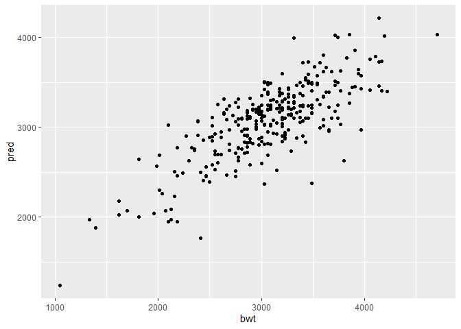

Hw 5
================
Amanda Kramer
12/13/20

  - I’m sorry there are so few commits and knitting, I ended up doing
    the whole thing on Sunday after I finally felt up to it, so theres
    limited info on github\!

## Problem 1

``` r
homicide_df = 
  read_csv("homicide-data.csv", na = c("", "NA", "Unknown")) %>%
  mutate( city_state = str_c(city, state, sep = "_"),
          victim_age = as.numeric(victim_age),
    resolved = case_when(
      disposition == "Closed without arrest" ~ 0,
      disposition == "Open/No arrest" ~ 0,
      disposition == "Closed by arrest" ~ 1,
    )) %>%
  filter(city_state != "Tulsa_AL") %>%
  filter(victim_race %in% c("White", "Black")) %>%
  select(city_state, resolved, victim_age, victim_race, victim_sex)
```

``` r
baltimore_df = homicide_df %>%
  filter(city_state == "Baltimore_MD")
glm(resolved ~ victim_age + victim_race + victim_sex, 
    data= baltimore_df,
    family = binomial()) %>%
broom::tidy() %>%
  mutate(
    OR = exp(estimate),
    CI_lower = exp(estimate - 1.96 * std.error),
    CI_upper = exp(estimate + 1.96 * std.error)
  ) %>%
  select(term, OR, starts_with("CI")) %>%
  knitr::kable(digits = 3)
```

| term              |    OR | CI\_lower | CI\_upper |
| :---------------- | ----: | --------: | --------: |
| (Intercept)       | 1.363 |     0.975 |     1.907 |
| victim\_age       | 0.993 |     0.987 |     1.000 |
| victim\_raceWhite | 2.320 |     1.648 |     3.268 |
| victim\_sexMale   | 0.426 |     0.325 |     0.558 |

``` r
model_results_df = homicide_df %>%
  nest(data = -city_state) %>%
  mutate(
    models = map(.x = data, ~glm(resolved ~ victim_age + victim_race + victim_sex, data= .x, family = binomial())), 
    results = map(models, broom::tidy)
  ) %>%
  select(city_state, results) %>%
  unnest(results) %>%
  mutate(
    OR = exp(estimate),
    CI_lower = exp(estimate - 1.96 * std.error),
    CI_upper = exp(estimate + 1.96 * std.error)
  )
model_results_df %>%
  filter(term == "victim_sexMale") %>%
  mutate(city_state = fct_reorder(city_state, OR)) %>%
  ggplot(aes(x = city_state, y = OR)) +
  geom_point() +
  geom_errorbar(aes(ymin = CI_lower, ymax = CI_upper)) +
  theme(axis.text.x = element_text(angle = 90, hjust = 1))
```

<!-- -->

## Problem 2

``` r
birthweight_df = 
  read_csv("birthweight.csv", na = c("", "NA", "Unknown")) %>%
  mutate(babysex = as.factor(babysex), mrace = as.factor(mrace))
```

I am a PopFam student who analyzes data similar to this quite
frequently. I decided to include common factors such as babies length,
gestational age, mothers race (minority stress has been shown to impact
birth weight), malformations, previous number of low weight births, and
cigarettes smoked in my model. However, malformations and previous
number of low weight babies did not have enough variation.

``` r
train_df = sample_n(birthweight_df, 320)
test_df = anti_join(birthweight_df, train_df)
```

    ## Joining, by = c("babysex", "bhead", "blength", "bwt", "delwt", "fincome", "frace", "gaweeks", "malform", "menarche", "mheight", "momage", "mrace", "parity", "pnumlbw", "pnumsga", "ppbmi", "ppwt", "smoken", "wtgain")

``` r
my_mod = lm(bwt ~ blength + mrace + gaweeks + smoken, data = train_df)
rmse(my_mod, train_df)
```

    ## [1] 337.2665

``` r
train_df %>% 
  add_predictions(my_mod) %>%
  add_residuals(my_mod) %>%
  ggplot(aes(x=bwt, y=pred)) +
  geom_point()
```

<!-- -->

``` r
train_df %>% 
  add_predictions(my_mod) %>%
  add_residuals(my_mod) %>%
  ggplot(aes(x=resid)) +
  geom_density()
```

<!-- -->
The residuals look good. They are normally distributed.

Additional models:

``` r
lenage_mod = lm(bwt ~ blength + gaweeks, data = train_df)
lensexhead_mod = lm(bwt ~ bhead*blength*babysex + bhead*blength + bhead*babysex + blength*babysex, data= train_df)
train_df %>% 
  gather_predictions(my_mod, lenage_mod, lensexhead_mod) %>%
  gather_residuals(my_mod, lenage_mod, lensexhead_mod)
```

    ## # A tibble: 2,880 x 23
    ##    model babysex bhead blength   bwt delwt fincome frace gaweeks malform
    ##    <chr> <fct>   <dbl>   <dbl> <dbl> <dbl>   <dbl> <dbl>   <dbl>   <dbl>
    ##  1 my_m~ 1          34      51  3203   176       5     2    39.9       0
    ##  2 my_m~ 2          32      50  2863   139      25     2    40.3       0
    ##  3 my_m~ 1          33      45  2466   133      25     2    40.4       0
    ##  4 my_m~ 2          36      52  3600   153      96     1    40         0
    ##  5 my_m~ 2          34      50  3572   122      75     1    41.6       0
    ##  6 my_m~ 1          36      54  3515   153      15     2    44         0
    ##  7 my_m~ 2          34      50  3402   142      25     4    43.3       0
    ##  8 my_m~ 1          33      51  3062   148       5     2    43.6       0
    ##  9 my_m~ 2          33      52  3033   154      55     1    41.1       0
    ## 10 my_m~ 2          32      48  2892   136      75     1    40.3       0
    ## # ... with 2,870 more rows, and 13 more variables: menarche <dbl>,
    ## #   mheight <dbl>, momage <dbl>, mrace <fct>, parity <dbl>, pnumlbw <dbl>,
    ## #   pnumsga <dbl>, ppbmi <dbl>, ppwt <dbl>, smoken <dbl>, wtgain <dbl>,
    ## #   pred <dbl>, resid <dbl>

``` r
cv_df = 
  crossv_mc(birthweight_df, 50) %>%
  mutate(
    train = map(train, as_tibble),
    test = map(test, as_tibble)) %>%
   mutate(
    my_mod  = map(train, ~lm(bwt ~ blength + mrace + gaweeks + smoken, data = train_df)),
    lenage_mod  = map(train, ~lm(bwt ~ blength + gaweeks, data = train_df)),
    headlensex_mod  = map(train, ~lm(bwt ~ bhead*blength*babysex + bhead*blength + bhead*babysex + blength*babysex, data= train_df))) %>% 
  mutate(
    rmse_my = map2_dbl(my_mod, test, ~rmse(model = .x, data = .y)),
    rmse_lenage = map2_dbl(lenage_mod, test, ~rmse(model = .x, data = .y)),
    rmse_headlensex = map2_dbl(headlensex_mod, test, ~rmse(model = .x, data = .y)))
  
cv_df %>% 
  select(starts_with("rmse")) %>% 
  pivot_longer(
    everything(),
    names_to = "model", 
    values_to = "rmse",
    names_prefix = "rmse_") %>% 
  mutate(model = fct_inorder(model)) %>% 
  ggplot(aes(x = model, y = rmse)) + geom_violin()
```

<!-- -->

I did not expect sex to be as important a predictor as it was.
Additonally, was also surprising to me head circumference.

## Problem 3

``` r
weather_df = 
  rnoaa::meteo_pull_monitors(
    c("USW00094728"),
    var = c("PRCP", "TMIN", "TMAX"), 
    date_min = "2017-01-01",
    date_max = "2017-12-31") %>%
  mutate(
    name = recode(id, USW00094728 = "CentralPark_NY"),
    tmin = tmin / 10,
    tmax = tmax / 10) %>%
  select(name, id, everything())
```

    ## Registered S3 method overwritten by 'hoardr':
    ##   method           from
    ##   print.cache_info httr

    ## using cached file: C:\Users\cbigg\AppData\Local\Cache/R/noaa_ghcnd/USW00094728.dly

    ## date created (size, mb): 2020-10-07 16:56:58 (7.54)

    ## file min/max dates: 1869-01-01 / 2020-10-31

``` r
weather_bootstrap_results = weather_df %>% 
  modelr::bootstrap(n = 5000) %>% 
  mutate(
    models = map(strap, ~lm(tmax ~ tmin, data = .x) ),
    results = map(models, broom::tidy),
    r2 = map2_dbl(models, strap, ~rmse(model = .x, data = .y)))%>%
  select(-strap, -models) %>% 
  unnest(results) %>% 
  pivot_wider(names_from = term, values_from = estimate:r2) %>% 
  janitor::clean_names() %>%
  mutate(calc = log(estimate_intercept * estimate_tmin)) %>%
  summarize(
    r2_ci_lower = quantile(r2_tmin, 0.025), 
    r2_ci_upper = quantile(r2_tmin, 0.975),
    calc_ci_lower = quantile(calc, 0.025), 
    calc_ci_upper = quantile(calc, 0.975)) 
weather_bootstrap_results %>% knitr::kable()
```

| r2\_ci\_lower | r2\_ci\_upper | calc\_ci\_lower | calc\_ci\_upper |
| ------------: | ------------: | --------------: | --------------: |
|      2.701757 |      3.138463 |        1.965246 |        2.058614 |
